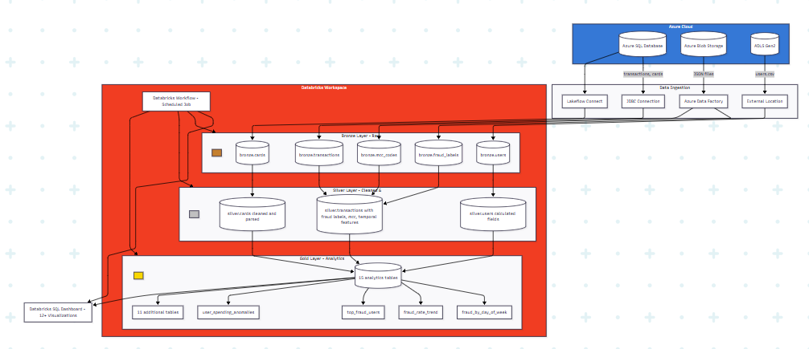
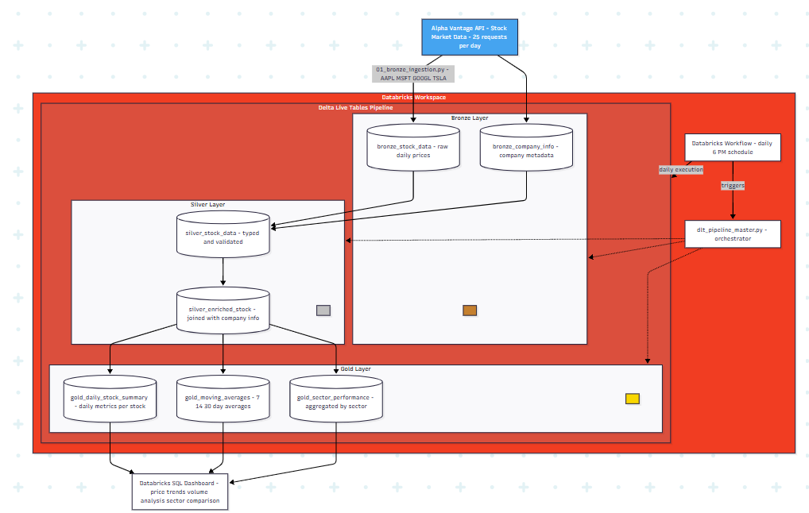

# Databricks Data Engineering Projects

**Author:** Humza Inam

---

## Introduction

This portfolio contains two data engineering projects built on Databricks using the medallion architecture (Bronze → Silver → Gold layers). Projects demonstrate ETL/DLT pipelines, data transformation with PySpark, and ELT dashboard creation.

### Business Context

**Project 1 - Fraud Detection Analytics**  
Credit card fraud costs billions annually. This project analyzes transaction data to identify fraud patterns by examining user behavior, merchant categories, transaction timing, and spending anomalies.

This uses the DataSet Fraud Transactions from Kaggle (https://www.kaggle.com/datasets/computingvictor/transactions-fraud-datasets)

**Project 2 - Stock Market Data Pipeline**  
Provides daily stock market analysis by ingesting data from an external API and creating aggregated metrics for tracking price trends, volume, and sector performance.

### Technologies Used
- **Platform:** Databricks, Azure
- **Storage:** Azure SQL Database, Azure Blob Storage, ADLS Gen2, Delta Lake
- **Processing:** PySpark, Apache Spark
- **Orchestration:** Databricks Workflows, Delta Live Tables (DLT)
- **Visualization:** Databricks SQL Dashboards
- **Architecture:** Medallion (Bronze → Silver → Gold)

---

## Project 1: Fraud Detection Analytics

### Overview
An ETL pipeline that processes credit card transaction data to identify fraud patterns using medallion architecture.

**Live Dashboard:** [View Dashboard](https://dbc-55adfddf-d02b.cloud.databricks.com/dashboardsv3/01f102a192c2173baeef888733179c53/published?o=1461506076643490)

### Dataset
5 related tables with transaction, user, card, and fraud information:
- **transactions_data** - Transaction details (amount, merchant, location, time)
- **fraud_labels** - Labels indicating if transaction is fraudulent
- **cards_data** - Card information (type, limits, security features)
- **users_data** - Customer demographics and financial info
- **mcc_codes** - Merchant category descriptions

### Experimented with Data Ingestion (Multiple Methods)
- **Azure SQL Database** → JDBC connection & Lakeflow Connect
- **Azure Blob Storage** → Azure Data Factory
- **Azure Data Lake Storage (ADLS Gen2)** → External Location

### Pipeline Architecture

**Bronze Layer (Raw Data)**
- Ingested 5 tables from various Azure sources
- Minimal transformation
- Stored in Delta format

**Silver Layer (Cleaned Data)**
- Cleaned data types (removed $ signs, parsed dates)
- Joined fraud labels and merchant categories to transactions
- Added calculated fields (day of week, hour, debt-to-income ratio)

**Gold Layer (Analytics Tables)**
- Created 15 tables answering business questions:
  - Fraud by day of week and time of day
  - Fraud trends over time
  - Top fraud users and merchants
  - Spending anomalies
  - Transaction patterns

### Dashboard
visualizations showing:
- Daily fraud trends and rates
- Fraud by merchant category
- User spending patterns
- Financial losses
- Temporal fraud patterns

### Orchestration
Workflow with 4 tasks:
1. Bronze ingestion
2. Silver transformation
3. Gold aggregation
4. Dashboard refresh

### Architecture Diagram

---

## Project 2: Stock Market DLT Pipeline

### Overview
A Delta Live Tables pipeline that automatically ingests and analyzes daily stock market data from Alpha Vantage API.

### Dataset
**Source:** Alpha Vantage API (free tier)  
**Symbols:** 4 stocks (AAPL, MSFT, GOOGL, TSLA)

**Data Collected:**
- Daily prices (Open, High, Low, Close)
- Trading volume
- Company information (sector, industry, exchange)

### Pipeline Design

**Bronze Layer**
- `bronze_stock_data` - Raw daily price data from API
- `bronze_company_info` - Company metadata

**Silver Layer**
- `silver_stock_data` - Cleaned and validated prices
- `silver_enriched_stock` - Joined with company info

**Gold Layer**
- `gold_daily_stock_summary` - Daily metrics per stock
- `gold_moving_averages` - 7, 14, and 30-day averages
- `gold_sector_performance` - Aggregated by sector

**Key Calculations:**
- Daily returns: (Close - Open) / Open × 100
- Price change percentage
- Moving averages for trend analysis

### Pipeline Configuration
- **Mode:** Triggered 
- **Tables:** Materialized views (batch processing)
- **Data Quality:** Validation checks on prices
- **Schedule:** Daily via Databricks Workflow

### Architecture Diagram

---

## Future Improvements

### General Enhancements
1. **Real-time Processing**
   - Implement streaming data ingestion
   - Add real-time fraud alerts
   - Enable minute-by-minute stock updates

2. **Machine Learning**
   - Build fraud prediction models
   - Predict stock price movements
   - Automate anomaly detection

3. **Data Quality**
   - Add automated data validation checks
   - Implement data profiling dashboards
   - Create data quality scorecards

4. **Monitoring & Alerts**
    - Set up email alerts for fraud spikes
    - Monitor pipeline failures
    - Track data freshness