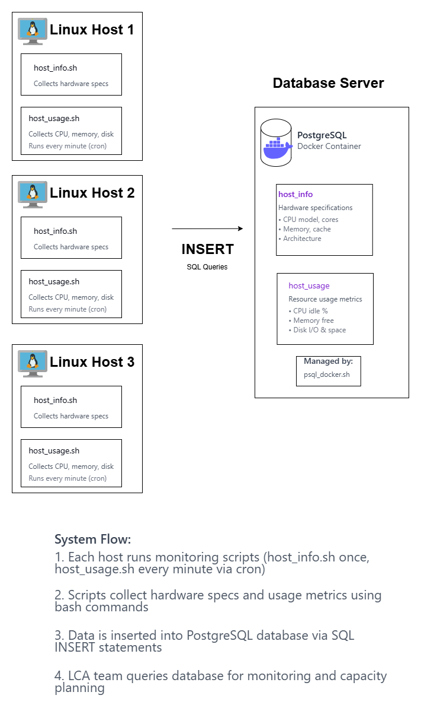

# Linux Cluster Monitoring Agent

## Introduction

The Linux Cluster Monitoring Agent offers a simple, scalable solution for keeping track of hardware specifications and real-time resource usage on Linux servers. Created for the Jarvis Linux Cluster Administration team, this MVP shows how basic command-line tools can work together to monitor a multi-node Rocky Linux cluster. A PostgreSQL database holds all the collected metrics. A Bash-based agent, made up of two scripts, collects hardware information and periodic CPU and memory usage. To ensure consistent setup, the database runs in a container using Docker, and cron runs the data collection every minute. This design provides the LCA team with a steady foundation for checking system performance and planning future resource needs.

---

## Quick Start

```bash
# 1. Start the PostgreSQL container
cd scripts
./psql_docker.sh create <db_username> <db_password>
./psql_docker.sh start

# 2. Create the database and tables
psql -h localhost -U <db_username> -W
CREATE DATABASE host_agent;
\q

psql -h localhost -U <db_username> -d host_agent -W -f sql/ddl.sql

# 3. Insert hardware specifications
chmod +x scripts/host_info.sh
./scripts/host_info.sh localhost 5432 host_agent <db_username> <db_password>

# 4. Insert hardware usage data
chmod +x scripts/host_usage.sh
./scripts/host_usage.sh localhost 5432 host_agent <db_username> <db_password>

# 5. Configure cron for automated monitoring
crontab -e
# Add this line:
* * * * * bash /path/to/linux_sql/scripts/host_usage.sh localhost 5432 host_agent <db_username> <db_password> > /tmp/host_usage.log 2>&1
```

---

## Implementation

To carry out this project, I first set up a Rocky Linux 9 virtual machine on Google Cloud Platform (GCP). I configured the instance with a VNC-enabled remote desktop environment, which let me work easily through a graphical interface. I installed key development tools like Git, Docker, Java, Maven, a desktop environment (XFCE), and various utilities using a startup script that ran during VM setup.

Once the environment was ready, I installed and configured Docker so the rocky user could run Docker commands without sudo. I used the `psql_docker.sh` script to deploy a PostgreSQL instance inside a Docker container. After that, I created the necessary database schema by running the `ddl.sql` file.

Next, I created two Bash scripts, `host_info.sh` and `host_usage.sh`, to collect hardware specifications and real-time usage data. I manually tested them by inserting data into the database and checking the results with SQL queries. To automate monitoring, I set up a cron job to run `host_usage.sh` every minute.

Throughout development, I followed GitFlow. I created feature branches for each script or component, merged them into the develop branch, and opened pull requests for final review before merging into main. This process ensured clear version control, organized code, and repeatable deployments.

---

## Architecture



*The architecture diagram shows three Linux hosts running the monitoring agent, each collecting hardware specs and usage data. All agents connect to a centralized PostgreSQL database running in a Docker container, where metrics are stored for analysis and reporting.*

---

## Scripts

### **`psql_docker.sh`**

Manages the lifecycle of the PostgreSQL Docker container for the monitoring database.

**Usage:**
```bash
# Create a new container (first-time setup)
./psql_docker.sh create <db_username> <db_password>

# Start an existing container
./psql_docker.sh start

# Stop the running container
./psql_docker.sh stop
```

---

### **`host_info.sh`**

Collects static hardware specifications from the host machine and inserts them into the `host_info` table. This script runs once per host to capture CPU details, architecture, cache size, and total memory.

**Usage:**
```bash
./scripts/host_info.sh <psql_host> <psql_port> <db_name> <db_user> <db_password>

# Example:
./scripts/host_info.sh localhost 5432 host_agent postgres password
```

---

### **`host_usage.sh`**

Captures real-time resource usage metrics including CPU idle percentage, memory availability, and disk I/O. This script is designed to run every minute via cron to provide continuous monitoring data.

**Usage:**
```bash
./scripts/host_usage.sh <psql_host> <psql_port> <db_name> <db_user> <db_password>

# Example:
./scripts/host_usage.sh localhost 5432 host_agent postgres password
```

---

### **`crontab`**

Automates the execution of `host_usage.sh` every minute to collect usage metrics without manual intervention.

**Setup:**
```bash
# Edit crontab
crontab -e

# Add the following line:
* * * * * bash /path/to/linux_sql/scripts/host_usage.sh localhost 5432 host_agent <db_username> <db_password> > /tmp/host_usage.log 2>&1
```

**Verification:**
```bash
# Check cron job was added successfully
crontab -l

# Monitor the log file
tail -f /tmp/host_usage.log
```

---

### **`queries.sql`**

Contains SQL queries to analyze monitoring data and solve business problems for the LCA team.

**Business Problem:**  
The LCA team needs to identify servers with low memory availability over the past hour to proactively plan resource allocation and prevent performance degradation.

**Query:**
```sql
-- Average memory usage per host in the last 60 minutes
SELECT h.hostname,
       AVG(hu.memory_free) AS avg_memory_free
FROM host_usage hu
JOIN host_info h ON hu.host_id = h.id
WHERE hu.timestamp >= NOW() - INTERVAL '1 hour'
GROUP BY h.hostname
ORDER BY avg_memory_free ASC;
```

**Usage:**
```bash
psql -h localhost -U <db_user> -d host_agent -f sql/queries.sql
```

---

## Database Modeling

### **`host_info`**

Stores static hardware specifications for each monitored host.

| Column             | Type      | Description                                      |
|--------------------|-----------|--------------------------------------------------|
| `id`               | SERIAL    | Unique identifier and primary key for each host  |
| `hostname`         | VARCHAR   | Fully-qualified hostname (unique)                |
| `cpu_number`       | INT       | Number of CPU cores/threads                      |
| `cpu_architecture` | VARCHAR   | CPU architecture (e.g., x86_64)                  |
| `cpu_model`        | VARCHAR   | CPU model name                                   |
| `cpu_mhz`          | NUMERIC   | CPU frequency in MHz                             |
| `l2_cache`         | INT       | L2 cache size in kilobytes                       |
| `total_mem`        | INT       | Total system memory in kilobytes                 |
| `timestamp`        | TIMESTAMP | Time when hardware specs were recorded           |

---

### **`host_usage`**

Captures periodic resource usage metrics from each host.

| Column           | Type      | Description                                      |
|------------------|-----------|--------------------------------------------------|
| `timestamp`      | TIMESTAMP | Time when the usage sample was collected         |
| `host_id`        | INT       | Foreign key referencing `host_info.id`           |
| `memory_free`    | INT       | Available memory in megabytes                    |
| `cpu_idle`       | INT       | CPU idle percentage (0-100)                      |
| `cpu_kernel`     | INT       | CPU time spent in kernel mode (percentage)       |
| `disk_io`        | INT       | Number of disk I/O operations                    |
| `disk_available` | INT       | Available disk space on root partition (MB)      |

---

## Test

To validate the DDL schema and bash scripts, I performed systematic testing within the PostgreSQL environment.

**1. Database Connection Test**

I connected to the PostgreSQL instance to verify the container and database were operational:
```bash
psql -h localhost -U <db_username> -d host_agent -W
```

**2. Schema Verification**

I confirmed both tables were created successfully:
```sql
\dt
```

Both `host_info` and `host_usage` tables appeared in the output, validating the DDL execution.

**3. Manual Data Insertion Test**

I inserted sample hardware data:
```sql
INSERT INTO host_info (hostname, cpu_number, cpu_architecture, cpu_model, cpu_mhz, l2_cache, total_mem, timestamp)
VALUES ('test-host', 4, 'x86_64', 'Intel Core i5', 2400.0, 256, 8192, NOW());
```

Then verified insertion:
```sql
SELECT * FROM host_info;
```

**Result:** Row inserted successfully with all columns populated correctly.

**4. Usage Data Test**

I inserted two sample usage records:
```sql
INSERT INTO host_usage (timestamp, host_id, memory_free, cpu_idle, cpu_kernel, disk_io, disk_available)
VALUES 
('2019-05-29 15:00:00', 1, 300000, 90, 4, 2, 3),
('2019-05-29 15:01:00', 1, 200000, 85, 5, 3, 3);
```

Verification query:
```sql
SELECT * FROM host_usage ORDER BY timestamp DESC;
```

**Result:** Both rows inserted correctly with proper foreign key relationships to `host_info`.

**5. Automated Script Testing**

After configuring crontab, I monitored automated insertions:
```bash
psql -h localhost -U <db_username> -d host_agent -c "SELECT COUNT(*) FROM host_usage;"
```

**Result:** Row count increased each minute, confirming the cron job and bash scripts executed successfully.

**Final Outcome:** All tests passed. The DDL created proper schema constraints, bash scripts collected accurate system metrics, and cron automation worked reliably.

---

## Deployment

This project uses a lightweight and easily reproducible setup that includes GitHub, Docker, PostgreSQL, and Linux automation tools. The source code is hosted on GitHub, and Git handles version control to track changes and allow collaboration efficiently. The PostgreSQL database runs in a Docker container, which ensures consistent performance across various environments and makes it easier for new users to set up.

After configuring the database and scripts, ongoing data collection is automated through crontab. It runs the `host_usage.sh` script every minute. This setup enables the monitoring agent to continuously capture CPU, memory, and disk metrics without any manual work. Overall, the deployment is straightforward, portable, and anyone can easily replicate it by cloning the repository, starting the Dockerized database, and enabling the cron job.

---

## Improvements

1. **Implement Data Visualization Dashboards**: We can integrate a web-based dashboard to show trends in CPU, memory, and disk usage over time. This will make it easier for non-technical team members to monitor data and allow for quicker decision-making.

2. **Add an Alerting and Notification System**: we can create alerts based on specific thresholds that send email or Slack notifications when key metrics go beyond set limits, such as memory usage exceeding 90% or disk space falling below 10%. This will help teams respond proactively instead of waiting to troubleshoot issues.

3. **Support Hardware Configuration Updates**: This system currently assumes that hardware configurations do not change. Improve `host_info.sh` so it can detect and update hardware changes, like RAM upgrades or CPU replacements. This involves comparing new specifications with existing records and inserting updates with timestamps for historical tracking.