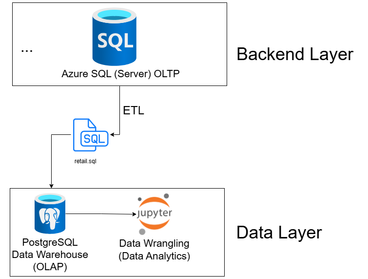

# London Gift Shop Customer Analytics

# Introduction

London Gift Shop (LGS) is a UK-based online giftware retailer serving both retail and wholesale customers for over 10 years. Despite a decade of operations, revenue has plateaued in recent years. The LGS marketing team seeks to leverage data analytics to better understand customer purchasing behavior and develop targeted marketing strategies to drive growth.

As the LGS marketing team lacks IT capability and the internal IT department has limited resources, LGS engaged Jarvis Consulting to deliver a proof-of-concept (PoC) data analytics solution. This project analyzes transactional retail data from December 2009 to December 2011 to uncover customer insights that will inform marketing campaigns, promotional strategies, and customer retention initiatives.

The analysis was conducted using Python within a Jupyter Notebook environment, leveraging Pandas for data manipulation, NumPy for numerical computations, and Matplotlib for visualization. The dataset was accessed through a PostgreSQL database using SQLAlchemy, and all data wrangling, cleaning, and RFM segmentation was performed to deliver actionable business intelligence for the LGS marketing team.

# Implementation

## Project Architecture

The project architecture consists of an ETL pipeline where transactional data is extracted from the LGS production database, transformed through Python-based analytics, and loaded into customer segment reports for marketing use.

**Architecture Diagram:**

The LGS online store runs on Azure cloud infrastructure with a web application connected to an Azure SQL Database storing transactional data. For this PoC, the LGS IT team exported retail transaction data (December 2009 - December 2011) into a SQL dump file, which was loaded into a local PostgreSQL database for analysis. The Jarvis data engineering team accessed this database through a Docker container running PostgreSQL, connected via SQLAlchemy within Jupyter Notebook.

The data flow follows this pattern:
1. **Data Extraction**: Transaction data retrieved from PostgreSQL using SQL queries
2. **Data Transformation**: Python/Pandas-based cleaning, aggregation, and RFM analysis
3. **Analytics Output**: Customer segments, monthly metrics, and business recommendations delivered to LGS marketing team

All personally identifiable information was removed by the LGS IT team prior to data sharing, ensuring compliance with privacy requirements.

## Data Analytics and Wrangling

The complete data analysis workflow is documented in the [Jupyter Notebook](./python_data_wrangling/retail_data_analytics_wrangling.ipynb).

### Key Analytical Findings

**1. Monthly Sales Trends**
- Sales exhibit strong seasonality with peaks in November (£1.5M) and significant drops in January and December
- Monthly sales growth fluctuates between -57% and +50%, indicating high volatility
- Average monthly sales: £759K with median of £737K

**2. Monthly Active Users**
- Active user counts range from 615 to 1,665 customers per month
- Strong correlation between active users and sales revenue
- User activity shows similar seasonal patterns to sales

**3. Customer Segmentation (RFM Analysis)**
- **Champions (852 customers)**: Recent purchases (30 days), high frequency (19 orders), high spend (£10,795 avg) - top-tier customers
- **Loyal Customers (1,147 customers)**: Moderate recency (89 days), regular purchases (10 orders), solid spend (£4,200 avg)
- **Potential Loyalists (713 customers)**: Recent buyers (47 days), low-moderate frequency (3 orders), lower spend (£1,155 avg)
- **At Risk (750 customers)**: Long inactivity (395 days), moderate frequency (4 orders), declining engagement
- **Hibernating (1,522 customers)**: Inactive (481 days), one-time buyers, minimal spend (£438 avg) - largest segment

### Marketing Strategy Recommendations

Based on the analytics, LGS should implement the following targeted strategies:

**1. Champion & Loyal Customer Retention**
- Launch a VIP loyalty program with exclusive early access to new products and special discounts
- Implement personalized email campaigns featuring products based on their purchase history
- These segments represent the highest revenue potential and should receive priority treatment

**2. Win Back At-Risk & Hibernating Customers**
- Create re-engagement campaigns with special "We Miss You" offers (10-15% discount codes)
- Send targeted emails highlighting new product arrivals relevant to their previous purchases
- Focus on the 2,272 customers in these segments to reactivate dormant revenue

**3. Seasonal Campaign Optimization**
- Prepare inventory and marketing campaigns for November (peak season)
- Launch early promotional campaigns in October to maximize Q4 revenue
- Address the December revenue drop with post-holiday promotions and January sales events

# Improvements

Given additional time and resources, the following enhancements would strengthen the analysis:

1. **Predictive Customer Lifetime Value (CLV) Modeling**: Implement machine learning models to predict future customer value and identify high-potential customers early for proactive engagement strategies.

2. **Product Recommendation Engine**: Build collaborative filtering or association rule mining (market basket analysis) to identify frequently purchased product combinations and enable cross-selling opportunities.

3. **Real-Time Dashboard Integration**: Develop an automated ETL pipeline with Power BI or Tableau dashboards that refresh daily, allowing the marketing team to monitor KPIs and segment performance in real-time without manual analysis.
